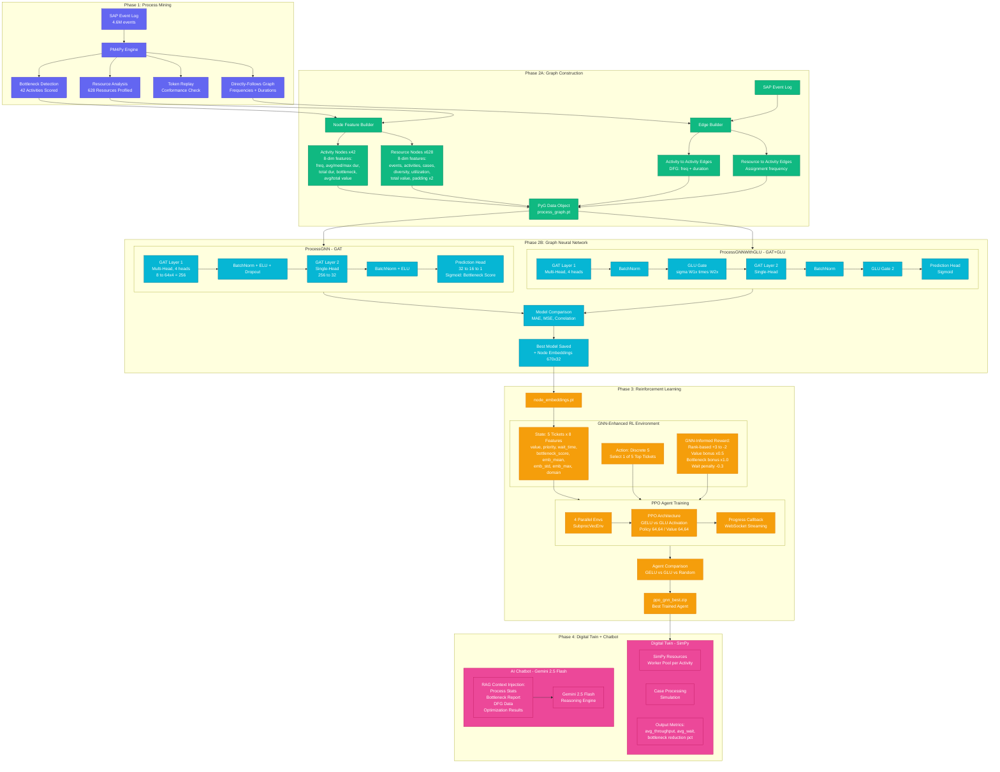

# AI-BPI System Architecture

## System Architecture

```mermaid
graph TB
    subgraph Frontend["Frontend - React + Vite"]
        App["App.tsx Router"]
        Home["Home Page"]
        Topology["Topology Page"]
        Telemetry["Telemetry Page"]
        Workforce["Workforce Allocation Page"]
        Chat["Floating Chatbot"]
        Training["Training Modal"]
        Toast["Toast Notifications"]
        Sidebar["Sidebar Navigation"]

        App --> Home
        App --> Topology
        App --> Telemetry
        App --> Workforce
        App --> Chat
        App --> Training
    end

    subgraph Backend["Backend - FastAPI + Uvicorn"]
        Server["server.py"]

        subgraph REST["REST API Endpoints"]
            TopologyAPI["/api/topology"]
            TelemetryAPI["/api/telemetry"]
            SimulateAPI["/api/simulate"]
            SuggestAPI["/api/suggest"]
            TrainAPI["/api/train"]
        end

        subgraph WS["WebSocket Endpoints"]
            ChatWS["ws://chat"]
            TrainWS["ws://training-progress"]
        end

        Server --> REST
        Server --> WS
    end

    subgraph AIEngine["AI-ML Engine"]
        ProcessMining["process_mining.py<br/>PM4Py: DFG, Bottlenecks,<br/>Conformance, Resources"]
        GraphBuilder["graph_builder.py<br/>PyG Data Object"]
        GNNModel["gnn_model.py<br/>GAT / GAT+GLU"]
        TrainGNN["train_gnn.py<br/>Model Training + Comparison"]
        GNNEnv["gnn_env.py<br/>GNN-Enhanced RL Env"]
        CustomEnv["custom_env.py<br/>Base RL Env"]
        TrainAgent["train_gnn_agent.py<br/>PPO Agent Training"]
    end

    subgraph Simulation["Digital Twin + Simulation"]
        DigitalTwin["digital_twin.py<br/>SimPy Simulation"]
        SimEngine["simulation_engine.py<br/>Company Simulation"]
    end

    subgraph ChatbotSub["AI Chatbot"]
        ChatbotCore["chatbot.py<br/>Gemini 2.5 Flash<br/>RAG Context Injection"]
    end

    subgraph DataLayer["Data Layer"]
        SAPXES["BPI_Challenge_2019.xes<br/>Raw SAP Event Log"]
        SAPCSV["sap_event_log.csv"]
        JiraData["synthetic_jira_data.csv"]
        TeamsData["synthetic_teams_data.csv"]
        TrainingCSV["training_data.csv"]
        UnifiedCSV["unified_master.csv"]
    end

    subgraph Artifacts["Model Artifacts"]
        ProcessGraph["process_graph.pt"]
        GNNWeights["gnn_process_model.pt"]
        Embeddings["node_embeddings.pt"]
        PPOAgent["ppo_gnn_best.zip"]
        BnReport["bottleneck_report.json"]
        DFGData["dfg_data.json"]
        ProcessStats["process_stats.json"]
    end

    Home -->|HTTP| TopologyAPI
    Telemetry -->|HTTP| TelemetryAPI
    Workforce -->|HTTP| SimulateAPI
    Workforce -->|HTTP| SuggestAPI
    Training -->|HTTP| TrainAPI
    Chat -->|WebSocket| ChatWS
    Training -->|WebSocket| TrainWS

    TopologyAPI -->|Reads| BnReport
    TopologyAPI -->|Reads| DFGData
    TelemetryAPI -->|Reads| ProcessStats
    SuggestAPI --> TrainAgent
    TrainAPI --> TrainAgent
    SimulateAPI --> DigitalTwin

    SAPXES --> ProcessMining
    SAPCSV --> ProcessMining
    ProcessMining --> BnReport
    ProcessMining --> DFGData
    ProcessMining --> ProcessStats
    BnReport --> GraphBuilder
    DFGData --> GraphBuilder
    SAPCSV --> GraphBuilder
    GraphBuilder --> ProcessGraph
    ProcessGraph --> TrainGNN
    TrainGNN --> GNNWeights
    TrainGNN --> Embeddings
    Embeddings --> GNNEnv
    TrainingCSV --> CustomEnv
    TrainingCSV --> GNNEnv
    GNNEnv --> TrainAgent
    TrainAgent --> PPOAgent

    ChatWS --> ChatbotCore
    ChatbotCore -->|RAG Context| ProcessStats
    ChatbotCore -->|RAG Context| BnReport
    ChatbotCore -->|RAG Context| DFGData

    SAPCSV --> DigitalTwin
    SAPCSV --> SimEngine

    classDef frontend fill:#3b82f6,stroke:#1d4ed8,color:#fff
    classDef backend fill:#8b5cf6,stroke:#6d28d9,color:#fff
    classDef ai fill:#10b981,stroke:#047857,color:#fff
    classDef data fill:#f59e0b,stroke:#d97706,color:#fff
    classDef artifact fill:#ef4444,stroke:#b91c1c,color:#fff
    classDef sim fill:#ec4899,stroke:#be185d,color:#fff
    classDef chat fill:#06b6d4,stroke:#0e7490,color:#fff

    class App,Home,Topology,Telemetry,Workforce,Chat,Training,Toast,Sidebar frontend
    class Server,TopologyAPI,TelemetryAPI,SimulateAPI,SuggestAPI,TrainAPI,ChatWS,TrainWS backend
    class ProcessMining,GraphBuilder,GNNModel,TrainGNN,GNNEnv,CustomEnv,TrainAgent ai
    class SAPXES,SAPCSV,JiraData,TeamsData,TrainingCSV,UnifiedCSV data
    class ProcessGraph,GNNWeights,Embeddings,PPOAgent,BnReport,DFGData,ProcessStats artifact
    class DigitalTwin,SimEngine sim
    class ChatbotCore chat
```

---

## Model Architecture (GNN + RL Pipeline)

```mermaid
graph TB
    subgraph Phase1["Phase 1: Process Mining"]
        SAP["SAP Event Log<br/>4.6M events"]
        PM4Py["PM4Py Engine"]

        SAP --> PM4Py

        PM4Py --> DFG["Directly-Follows Graph<br/>Frequencies + Durations"]
        PM4Py --> Bottlenecks["Bottleneck Detection<br/>42 Activities Scored"]
        PM4Py --> Conformance["Token Replay<br/>Conformance Check"]
        PM4Py --> Resources["Resource Analysis<br/>628 Resources Profiled"]
    end

    subgraph Phase2A["Phase 2A: Graph Construction"]
        NodeBuilder["Node Feature Builder"]

        Bottlenecks --> NodeBuilder
        Resources --> NodeBuilder

        NodeBuilder --> ActNodes["Activity Nodes x42<br/>8-dim features:<br/>freq, avg/med/max dur,<br/>total dur, bottleneck,<br/>avg/total value"]
        NodeBuilder --> ResNodes["Resource Nodes x628<br/>8-dim features:<br/>events, activities, cases,<br/>diversity, utilization,<br/>total value, padding x2"]

        DFG --> EdgeBuilder["Edge Builder"]
        SAP2["SAP Event Log"] --> EdgeBuilder

        EdgeBuilder --> DFGEdges["Activity to Activity Edges<br/>DFG: freq + duration"]
        EdgeBuilder --> RAEdges["Resource to Activity Edges<br/>Assignment frequency"]

        ActNodes --> PyGData["PyG Data Object<br/>process_graph.pt"]
        ResNodes --> PyGData
        DFGEdges --> PyGData
        RAEdges --> PyGData
    end

    subgraph Phase2B["Phase 2B: Graph Neural Network"]
        PyGData --> GATModel

        subgraph GATModel["ProcessGNN - GAT"]
            GAT1["GAT Layer 1<br/>Multi-Head, 4 heads<br/>8 to 64x4 = 256"]
            BN1["BatchNorm + ELU + Dropout"]
            GAT2["GAT Layer 2<br/>Single-Head<br/>256 to 32"]
            BN2["BatchNorm + ELU"]
            Predictor["Prediction Head<br/>32 to 16 to 1<br/>Sigmoid: Bottleneck Score"]

            GAT1 --> BN1 --> GAT2 --> BN2
            BN2 --> Predictor
        end

        PyGData --> GLUModel

        subgraph GLUModel["ProcessGNNWithGLU - GAT+GLU"]
            GLUGAT1["GAT Layer 1<br/>Multi-Head, 4 heads"]
            GLUBN1["BatchNorm"]
            GLU1["GLU Gate<br/>sigma W1x times W2x"]
            GLUGAT2["GAT Layer 2<br/>Single-Head"]
            GLUBN2["BatchNorm"]
            GLU2["GLU Gate 2"]
            GLUPred["Prediction Head<br/>Sigmoid"]

            GLUGAT1 --> GLUBN1 --> GLU1 --> GLUGAT2 --> GLUBN2 --> GLU2
            GLU2 --> GLUPred
        end

        GATModel --> Compare["Model Comparison<br/>MAE, MSE, Correlation"]
        GLUModel --> Compare
        Compare --> Winner["Best Model Saved<br/>+ Node Embeddings 670x32"]
    end

    subgraph Phase3["Phase 3: Reinforcement Learning"]
        Winner --> EmbeddingsFile["node_embeddings.pt"]

        subgraph RLEnv["GNN-Enhanced RL Environment"]
            State["State: 5 Tickets x 8 Features<br/>value, priority, wait_time,<br/>bottleneck_score, emb_mean,<br/>emb_std, emb_max, domain"]
            Action["Action: Discrete 5<br/>Select 1 of 5 Top Tickets"]
            Reward["GNN-Informed Reward:<br/>Rank-based +3 to -2<br/>Value bonus x0.5<br/>Bottleneck bonus x1.0<br/>Wait penalty -0.3"]
        end

        EmbeddingsFile --> State

        subgraph PPOTraining["PPO Agent Training"]
            PPOArch["PPO Architecture<br/>GELU vs GLU Activation<br/>Policy 64,64 / Value 64,64"]
            ParallelEnv["4 Parallel Envs<br/>SubprocVecEnv"]
            Callback["Progress Callback<br/>WebSocket Streaming"]

            ParallelEnv --> PPOArch
            PPOArch --> Callback
        end

        State --> PPOTraining
        Action --> PPOTraining
        Reward --> PPOTraining

        PPOTraining --> AgentCompare["Agent Comparison<br/>GELU vs GLU vs Random"]
        AgentCompare --> BestAgent["ppo_gnn_best.zip<br/>Best Trained Agent"]
    end

    subgraph Phase4["Phase 4: Digital Twin + Chatbot"]
        BestAgent --> DTwin

        subgraph DTwin["Digital Twin - SimPy"]
            SimResources["SimPy Resources<br/>Worker Pool per Activity"]
            CaseProcess["Case Processing<br/>Simulation"]
            Metrics["Output Metrics:<br/>avg_throughput, avg_wait,<br/>bottleneck reduction pct"]
        end

        subgraph ChatAI["AI Chatbot - Gemini 2.5 Flash"]
            Context["RAG Context Injection:<br/>Process Stats<br/>Bottleneck Report<br/>DFG Data<br/>Optimization Results"]
            Gemini["Gemini 2.5 Flash<br/>Reasoning Engine"]
            Context --> Gemini
        end
    end

    classDef phase1 fill:#6366f1,stroke:#4338ca,color:#fff
    classDef phase2 fill:#10b981,stroke:#047857,color:#fff
    classDef phase3 fill:#f59e0b,stroke:#d97706,color:#fff
    classDef phase4 fill:#ec4899,stroke:#be185d,color:#fff
    classDef model fill:#06b6d4,stroke:#0e7490,color:#fff

    class SAP,PM4Py,DFG,Bottlenecks,Conformance,Resources phase1
    class NodeBuilder,ActNodes,ResNodes,EdgeBuilder,DFGEdges,RAEdges,PyGData,SAP2 phase2
    class GAT1,BN1,GAT2,BN2,Predictor,GLUGAT1,GLUBN1,GLU1,GLUGAT2,GLUBN2,GLU2,GLUPred,Compare,Winner model
    class EmbeddingsFile,State,Action,Reward,PPOArch,ParallelEnv,Callback,AgentCompare,BestAgent phase3
    class DTwin,SimResources,CaseProcess,Metrics,ChatAI,Context,Gemini phase4
```
